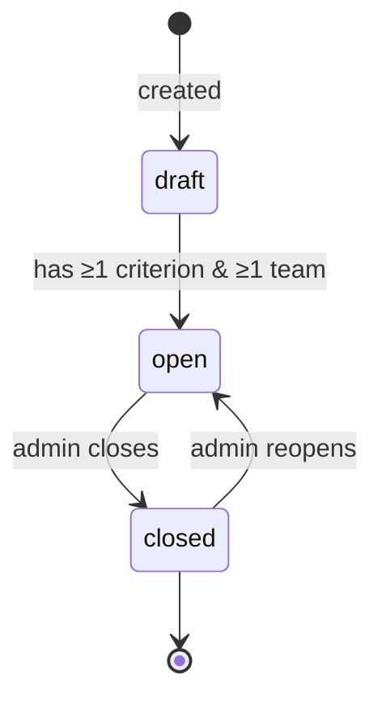
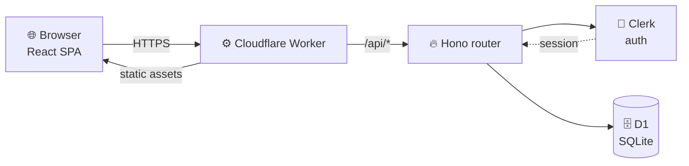

<div align="center">


# 🏆 JUDGE PANEL
### *One Worker. Every round. Zero double-scoring.*

<br/>


<br/>

**Multi-round judging for VMEDITHON** — teams get imported, rounds get opened, judges score once, and a live leaderboard falls out the other end. No spreadsheets. No "wait, who already judged Team 7?"

</div>

---

## 📖 Table of Contents

- [🩺 What is this](#-what-is-this)
- [🎭 Two Roles, One Battlefield](#-two-roles-one-battlefield)
- [🧮 The Scoring Formula](#-the-scoring-formula)
- [🔁 A Round's Life](#-a-rounds-life)
- [🏗️ Architecture](#️-architecture)
- [✨ Feature Walkthrough](#-feature-walkthrough)
- [🛡️ Guardrails Baked Into the DB](#️-guardrails-baked-into-the-db)
- [🚀 Running It Locally](#-running-it-locally)
- [✅ Checks](#-checks)
- [📁 Layout](#-layout)
- [☁️ Deploy](#️-deploy)
- [📜 License](#-license)

---

## 🩺 What is this

A single **Cloudflare Worker** does double duty: it serves the React SPA *and* answers the `/api/*` routes, backed by **D1** for storage and **Clerk** for sign-in. No separate frontend/backend deploys, no CORS dance — one Worker, one deploy, done.

Admins sign in with email + a one-time code. Judges sign in with a username and password an admin created for them. That's the entire access model — deliberately boring, because judging night is not the time for a complicated auth flow.

## 🎭 Two Roles, One Battlefield

| | 🛠️ Admin | ⚖️ Judge |
|---|---|---|
| Sign-in | Email + one-time code | Username + password |
| Teams | Import via CSV, add/edit | — |
| Rounds | Create, open, close, reopen | — |
| Criteria | Define per round (≤ 20) | — |
| Judging | — | Score assigned/open rounds |
| Results | View + reset any score | View only (all rounds) |
| Accounts | Manage admins & judges | — |

## 🧮 The Scoring Formula

Every round's team score is a weighted percentage:

```
Score = 100 × Σ(marks ÷ max_marks × weight) ÷ Σ weight
```

Weights don't need to add up to 100 — the UI shows each criterion's effective **Share** so it's obvious what actually matters. Ties share a rank (`1, 1, 3, …`), competition-style.

## 🔁 A Round's Life



Criteria lock the moment a round has **any** score in it. Want to change them? Reset the round's scores first — that's the only way back in.

## 🏗️ Architecture



## ✨ Feature Walkthrough

### 👥 Teams
Bulk-import from CSV (`Team Name`, `Team Leader Name`, optional `PS` + `Short Desc`). Registration-form exports work as-is — every other column (emails, phone numbers, payment screenshots…) is read and immediately thrown away. Team name is the import key, so re-uploading a name updates that team. Whole file validates before anything is written — one bad row, zero rows imported. Cap: 2,000 teams.

### 🥇 Rounds
Any number of rounds, each with its own criteria (name, max marks, weight) and its own roster pulled from the team list.

### ⚖️ Judging
Search-to-select, one team at a time, marks per criterion (0 → max, 2 decimals) plus optional remarks. **Submit is final** — no edits after. The instant one judge submits for a team, everyone else sees "Already judged." The DB itself enforces this (`UNIQUE(round_id, team_id)`), so even a dead-heat double-submit only lets the first one through.

### 📊 Results
Live leaderboard per round — rank, per-criterion marks, weighted total, judge, remarks. CSV export for both roles. Admin-only **Reset** wipes one team's score so it can be re-judged (the API rejects a judge's reset attempt even off-UI).

## 🛡️ Guardrails Baked Into the DB

Not just app logic — the schema itself won't let these happen:

- 🔒 **One score per team per round** — `UNIQUE(round_id, team_id)` on `evaluations`
- 🧊 **Criteria freeze on first score** — no rewriting the rules mid-judging
- 📸 **Every evaluation snapshots its criteria** — later criteria edits never rewrite history
- 🚫 **No deleting scored teams or rounds** — has to be reset first
- ✍️ **Re-checked at write time** — round-still-open and team-still-in-round are verified again on submit, not just at page load

## 🚀 Running It Locally

```bash
bun install
cp .dev.vars.example .dev.vars   # fill in your Clerk keys
bun run db:migrate:local
bun run dev                      # → http://localhost:5173
```

## ✅ Checks

```bash
bun run typecheck
bun run test
bun run build
bun run db:migrate:local
```

## 📁 Layout

| Path | Purpose |
|---|---|
| `worker/` | Hono API on the Worker (`/api/*`) |
| `src/` | React single-page app |
| `shared/` | Types + scoring logic shared by API and app |
| `migrations/` | D1 schema, applied in order |
| `docs/` | Auth rules, setup, and performance verification |

## ☁️ Deploy

<details>
<summary><strong>Production setup (click to expand)</strong></summary>
<br/>

Worker **`judge`** serves `judge.vmedithon.co.in` in the **VMedithon** Cloudflare account. Cloudflare's connected build deploys `main`; PR branch uploads are *not* production.

1. `bunx wrangler d1 create judge-vmed` → drop the `database_id` into `wrangler.jsonc`
2. Set `CLERK_PUBLISHABLE_KEY` in `wrangler.jsonc` → `vars`
3. `bunx wrangler secret put CLERK_SECRET_KEY`
4. `bun run db:migrate:remote`
5. Push a branch, open a PR against `VMedithon/judge-vmed` — merge triggers the deploy

D1 migrations are **not** applied automatically on deploy — that's always a manual `db:migrate:remote`. Clerk app is **VMEDITHON Judging**, production instance on `clerk.judge.vmedithon.co.in`.

</details>

## 📜 License

Private project — built for VMEDITHON, not published for reuse.

---

<div align="center">

<br/><br/>

**Built for VMEDITHON** · scored with weighted averages, not vibes ⚖️

</div>
